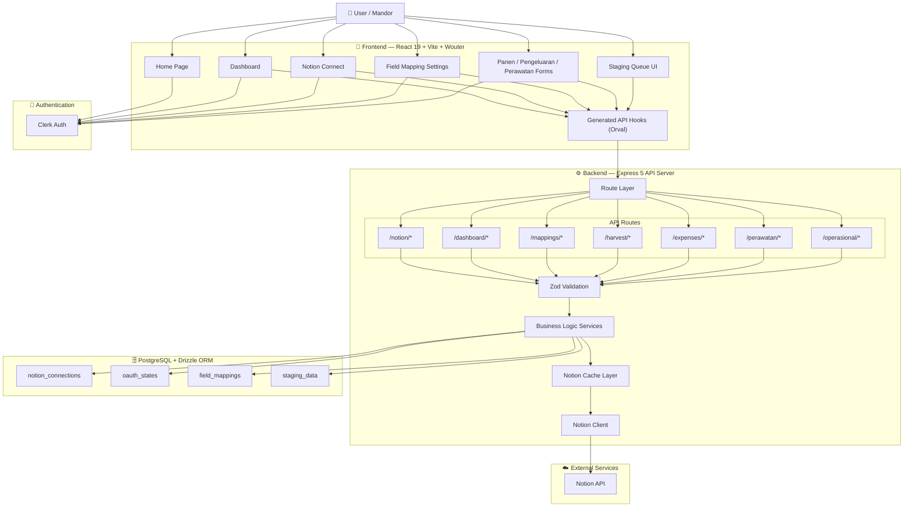
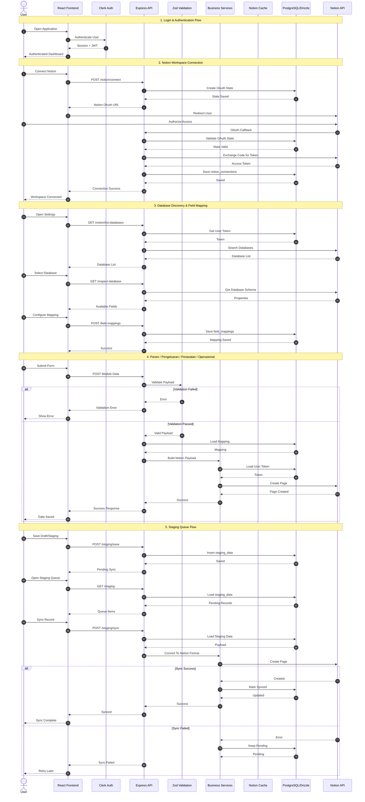

# 🚜 SambelFarm - Farm Management Platform

SambelFarm adalah sistem ERP internal berbasis web untuk manajemen operasional dan keuangan kebun. Sistem ini menggunakan React di Frontend dan Express di Backend, serta diintegrasikan langsung dengan **Notion API** sebagai database utama.

---

## 🗺️ 1. PETA ALUR SISTEM (Structural View)
Diagram di bawah ini memetakan bagaimana komponen Frontend, Backend, Database, dan Notion saling terhubung secara fisik dan logis.

---

## ⏱️ 2. KRONOLOGI ALUR DATA (Sequence View)
Diagram di bawah ini merincikan urutan kejadian detik per detik dari setiap fitur utama aplikasi.

